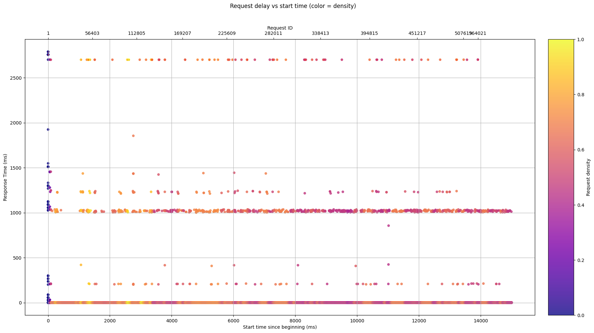
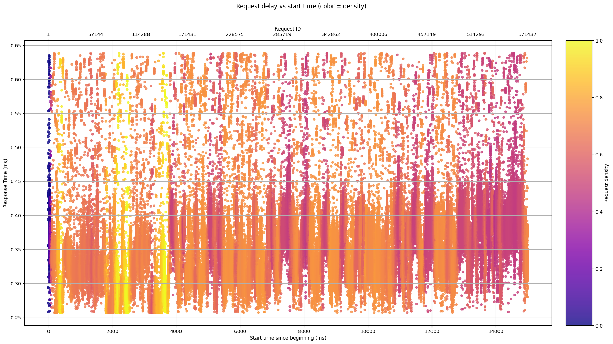

# 🌐 Webserv - HTTP Server in C++98
---
[](https://github.com/Moutigll/webserv/actions/workflows/c-cpp.yml)
## Running the Server

### 1. Compile

```bash
make
```

### 2. Run the server

With a configuration file:

```bash
./webserv config/example.conf
```

---

## ⚙️ Configuration File Structure

A minimal example:

```conf
log_level debug;
log_file ./server.log;
log_console on;
# A comment
server {
	server_name one.example.com www.one.example.com;
	listen 8080;
	listen 4242;
	timeout 30;
	allowed_methods GET POST HEAD;
	max_body_size 4096;
	error_pages ./ressources/html/errors/ {
		400 404.html;
		404 404.html;
		500 500.html;
		502 502.html;
	}
	location / {
		root ./ressources/html/;
		index index.html;
		try_files $uri $uri/ /index.php?$args;
		allowed_methods GET POST;
		autoindex on;
	}
	location /images/ {
		root ./ressources/images/;
		alias /home/images/;
		autoindex off;
	}
};
```

Multiple server blocks can be defined in the configuration file to listen on different ports or domains.

---
## Performance

### Benchmark executed locally (no logs, compiled with `-O3`)

The performance tests were run on a localhost with logging disabled, using the `-O3` optimization flag during compilation.  

The Python script used to generate the graphs is located at:

~~~
ressources/scripts/graph.py
~~~

### Raw Results

- **High latency scenario**: includes all measurements, including outliers (extreme delays, GC, etc.).
- **Low latency scenario**: trimmed mean (1% of extreme values removed), giving a clearer view of real performance.

<p align="center">
  
  
</p>

### High (raw) latency data

~~~
Total requests:       564021
Successful:           563921
Failed:               100
Average time (ms):    2.72
Median time (ms):     0.35
Average requests/sec: 40560.07
Longest:              2789.93ms
Shortest:             0.09ms
~~~

### Low (filtered) latency data

~~~
Total requests:       571437
Successful:           571437
Failed:               0
Average time (ms):    0.34
Median time (ms):     0.34
Average requests/sec: 38097.74
Longest:              0.64ms
Shortest:             0.26ms
~~~

