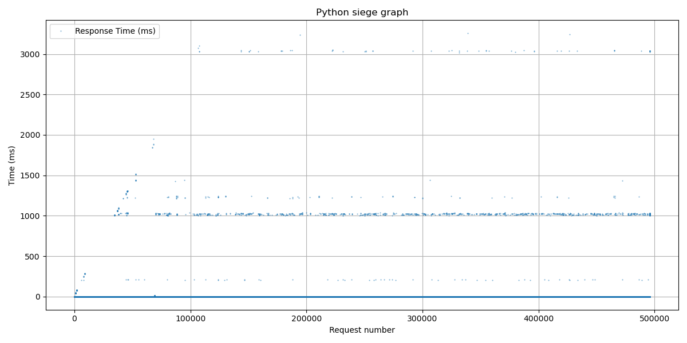

# 🌐 Webserv - HTTP Server in C++98
---
[](https://github.com/Moutigll/webserv/actions/workflows/c-cpp.yml)
## Running the Server

### 1. Compile

```bash
make
```

### 2. Run the server

With a configuration file:

```bash
./webserv config/example.conf
```

---

## ⚙️ Configuration File Structure

A minimal example:

```conf
log_level debug;
log_file ./server.log;
log_console on;
# A comment
server {
	server_name one.example.com www.one.example.com;
	listen 8080;
	listen 4242;
	timeout 30;
	allowed_methods GET POST HEAD;
	max_body_size 4096;
	error_pages ./ressources/html/errors/ {
		400 404.html;
		404 404.html;
		500 500.html;
		502 502.html;
	}
	location / {
		root ./ressources/html/;
		index index.html;
		try_files $uri $uri/ /index.php?$args;
		allowed_methods GET POST;
		autoindex on;
	}
	location /images/ {
		root ./ressources/images/;
		alias /home/images/;
		autoindex off;
	}
};
```

Multiple server blocks can be defined in the configuration file to listen on different ports or domains.

---
## Performances
### Benchmark in local without logs enabled and -O3
see `ressources/scripts/graph.py`


```bash
Duration:             15 seconds
Total requests:       495842
Successful:           495842
Failed:               0
Average time (ms):    3.12
Median time (ms):     0.42
Average requests/sec: 33056.13
Longest:              3256.64ms
Shortest:             0.16ms
```
