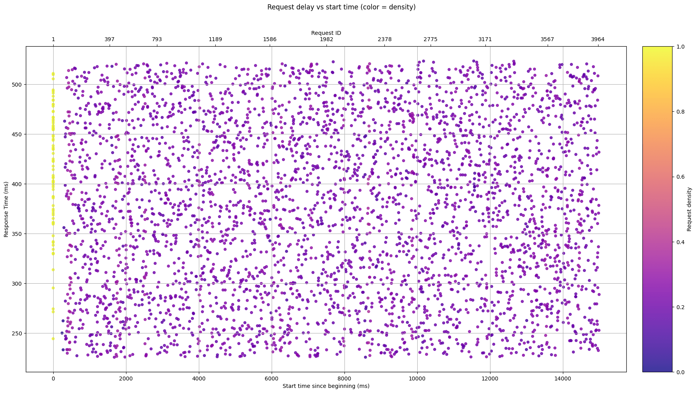

# Siege Benchmark Visualizer (Custom C Implementation)

This project provides a lightweight benchmarking tool written in **C** that simulates siege-style load testing on websites. A Python script is provided to **generate graphs** from the collected response times.

Unlike the original [`siege`](https://www.joedog.org/siege-home/), this project is a **minimal custom version written entirely in C**, with full control over its behavior and output format.

---

## 📁 Project Structure

```bash
.
├── Siege.c                # C implementation of the benchmarking tool
├── siege                  # Compiled binary (output of Siege.c)
├── graph.py               # Python script to generate performance graphs
├── results.csv            # Automatically generated benchmark results
├── requirements.txt       # Python packages for graph.py
├── examples/              # Sample output images
```

---

## ⚙️ Installation & Setup

### 1. Install Python with pyenv (Recommended)

To avoid conflicts with system Python:

```bash
# Install pyenv if not already installed
curl https://pyenv.run | bash

# Restart your shell or follow pyenv instructions

# Install a specific Python version (e.g. 3.11)
pyenv install 3.11.9
pyenv local 3.11.9

# Install dependencies
pip install -r requirements.txt
```

---

### 2. Compile the C Benchmark Tool

This tool requires the `libcurl` development library. On Ubuntu/Debian, you can install it with:

```bash
sudo apt install libcurl4-openssl-dev
```

Then compile the benchmarking tool with pthread and curl:

```bash
gcc -o siege Siege.c -lcurl -lpthread
```

This will create the `./siege` binary.

---

## 🚀 Usage

### Benchmark a Target Website

```bash
./siege --url=https://example.com -t=42 -d=10
./siege --url=42.42.42.42
```

This performs numerous HTTP requests and writes the average timing data to `results.csv`.

---

### Benchmark a Local Server

Start a test server in another terminal
Then run the benchmark:

```bash
python graph.py http://localhost:8000
```

This will rune siege and create visual graphs based on `results.csv`.

---

## 📊 Example Output

Here are some example graphs from the `/examples` directory:

### Cloudflare dns

Cloudflare DNS exhibits **initial responsiveness** with **low jitter**, maintaining **tight 5ms latency bands** for the first 4 seconds. Around **2 seconds**, a subtle 1ms delay shift appears, followed by a **progressive soft denial** of traffic after 4 seconds. The rejection pattern is **organic but structured**, with **occasional sharp spike**s, notably a **dominant rejection peak at 4ms**, and rarer outliers reaching up to 70ms.


---

### Wikipedia

**Wikipedia** demonstrates remarkable consistency and reliability, with **zero** failed requests and an **extremely narrow latency** range (`29.56ms` to `31.76ms`).


```bash
Duration:             14.94 seconds
Total requests:       48866
Successful:           48866
Failed:               0
Average time (ms):    29.93
Median time (ms):     29.82
Average requests/sec: 3271.75
Longest:              31.76ms
Shortest:             29.56ms
```

---

### Google.com  

Requests to **google.com** show a **highly randomized** distribution between **200ms and 550ms**, with **uniformly scattered response times** and **no discernible pattern**. This level of entropy and even dispersion is **remarkably unique**, possibly indicative of **heavy anycast balancing** or **aggressive obfuscation of internal routing behaviors**.



---

### OSTJourney (self-hosted)  Nginx + lim req/s and custom burst

The rate-limiting behavior is clearly visible, with a **distinct boundary line** marking the allowed request rate. **Occasional bursts** are permitted, showing up as **regular bumps** at fixed intervals, consistent with a **configured request burst policy**.


---

## 🧪 Notes

- Every run overwrites `results.csv`. Back it up if you want to compare results.

---

## 📜 License

This project is released under the GPL 3.0 license

Feel free to use, fork, and improve!
